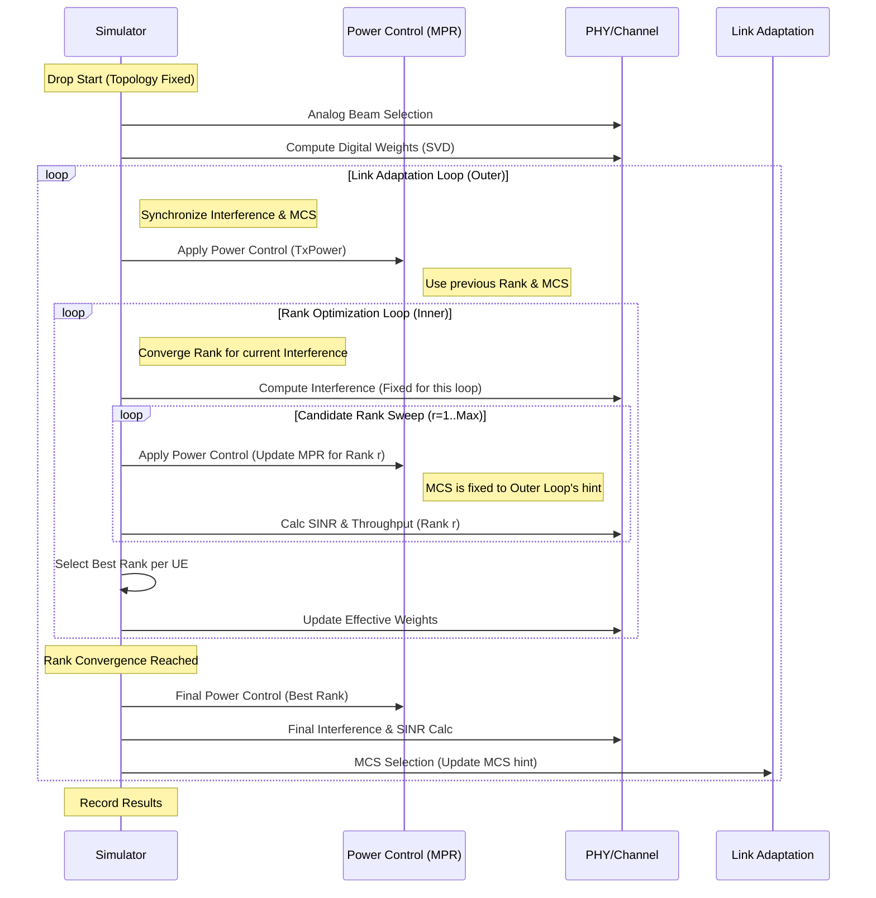

# SLS Simulation Loop & Logic Documentation

## Overview
本ドキュメントでは、System Level Simulation (SLS) における主要なループ構造（Link Adaptation Loop, Rank Optimization Loop）と、その中での各種パラメータ（SINR, MCS, MPR）の更新タイミングについて解説します。

## Loop Structure
シミュレーションは以下の二重ループ構造で構成されています。

1.  **Outer Loop (Link Adaptation Loop)**: `la_iter`
    *   目的: システム全体の干渉（Interference）とMCSの整合・収束。
    *   更新対象: 送信電力制御（Power Control）、MCS、全体的な干渉電力。
2.  **Inner Loop (Rank Optimization Loop)**: `rank_iter` (inside `_optimize_rank_allocation`)
    *   目的: 固定された干渉環境下での、各UEの最適なMIMOランクの探索・収束。
    *   更新対象: Rank、有効なPrecoding行列、MPR（Rank依存部分）。

### Sequence Diagram
以下の図は、1回の「Drop」内での処理フローを示しています。



### Logic Flow Chart

```mermaid
flowchart TD
    Start[Start Drop] --> AnalogBeam[Analog Beam Selection]
    AnalogBeam --> DigitalWeight[Digital Weight SVD]
    DigitalWeight --> InitRank[Init Rank = Max]
    InitRank --> OuterLoopStart{Outer Loop<br>(Interference/MCS)}

    OuterLoopStart -- Iteration --> PC_Outer[Power Control<br>(Base Power Calculation)]

    subgraph RankOptimization["Rank Optimization (Inner Loop)"]
        direction TB
        PC_Outer --> CalcInt[Compute Interference<br>(Fixed for Inner Loop)]
        CalcInt --> InnerLoopStart{Inner Loop<br>(Rank Convergence)}

        InnerLoopStart -- Iteration --> RankSweep[Rank Sweep r=1..Max]

        RankSweep --> PCRank[Power Control<br><b>Update MPR for Rank r</b>]
        PCRank --> CalcMetrics[Calc SINR & Throughput]
        CalcMetrics --> Compare[Select Best Rank]
        Compare --> UpdateWeights[Update Effective Weights]
        UpdateWeights --> InnerLoopStart

        InnerLoopStart -- Converged/MaxIter --> ReturnRank[Return Best Rank]
    end

    ReturnRank --> FinalCalc[Final SINR Calculation]
    FinalCalc --> UpdateMCS[Update MCS<br>(New Hint for Next Outer Loop)]
    UpdateMCS --> OuterLoopStart

    OuterLoopStart -- Converged/MaxIter --> Record[Record Drop Results]
    Record --> End[End Drop]
```

## Parameter Updates

### MPR (Maximum Power Reduction)
MPRは以下の2つのタイミングで更新・参照されます。

1.  **Inner Loop (Rank Sweep時)**:
    *   **更新頻度**: 候補ランク `r` を試行するたびに更新。
    *   **依存**: `Rank=r` (可変), `MCS=hint` (Outer Loop値で固定), `Waveform` (固定)。
    *   **目的**: ランク数が増えるとPAPRが悪化しMPRが増大するため、これを考慮して公平にスループットを比較する。

2.  **Outer Loop (PC適用時)**:
    *   **更新頻度**: Outer Loopの各反復の初頭。
    *   **依存**: `Rank=BestRank` (Inner Loop結果), `MCS=hint` (前回のOuter Loop結果)。
    *   **目的**: 確定したRankとMCSに基づいて、正確な送信電力を決定する。

### MCS (Modulation and Coding Scheme)
*   **更新**: **Outer Loopの最後**に一度だけ更新されます。
*   **Inner Loop内**: 直前のOuter Loopで計算されたMCS (初回はQPSK等の初期値) を「ヒント」として固定使用します。
    *   理由: RankとMCSを同時に探索すると探索空間が爆発するため、交互最適化のアプローチを採っています。

### Interference (干渉)
*   **Inner Loop内**: 干渉電力（`i_total`）はループの先頭で計算された値を「固定」して扱います（他UEのRankが変化しないと仮定）。
*   **Outer Loop**: Rankが更新された後の重みを用いて干渉を再計算し、全体をリフレッシュします。
