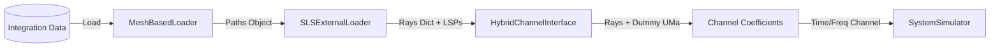

# SLS External Data Integration Guide

## 概要
このドキュメントでは、Sionna-Simのシステムレベルシミュレーション (SLS) において、外部で生成されたRay Tracing (RT) データ（HDF5/Zarr形式）をどのようにロードし、活用しているかを解説します。また、現状の実装におけるアーキテクチャ上の課題と、将来の改善案についても記述します。

## データフローとアーキテクチャ

外部RTデータは、以下のパイプラインを経てSLSシミュレータに供給されます。

### コンポーネントの役割

1.  **`MeshBasedLoader` (`src/wsim/rt/external/loaders.py`)**
    *   **役割**: HDF5/Zarrファイルからデータを読み込み、Sionna標準の `Paths` オブジェクト（DrJit Tensorを含む）として返します。
    *   **特徴**: 純粋なデータローダーであり、シミュレーションロジックは持ちません。

2.  **`SLSExternalLoader` (`experiments/hybrid_beamforming/sls/external_loader.py`)**
    *   **役割**: **アダプター (Adapter)** として機能します。
    *   **変換処理**:
        *   `Paths` オブジェクトから、`HybridChannelInterface` が要求する辞書形式（`delays`, `powers`, `aoa`, `aod`, `zoa`, `zod`, `xpr`）への変換。
        *   不足しているLSP（Path Loss, Shadow Fading, K-Factor）のダミー生成（既にRTデータに含まれているゲインをそのまま使うため）。
    *   **委譲処理**:
        *   Sionnaのインターフェースが要求する `_cir_sampler` メソッドを提供するため、内部でダミーの `UMa` チャネルモデル（`PanelArray` 設定済み）をインスタンス化し、処理を委譲しています。

3.  **`HybridChannelInterface` (`src/wsim/sls/channel/interface.py`)**
    *   **役割**: SLSシミュレータと外部データの接点。
    *   **処理**: 必要なUT/BSペアのデータを抽出し、`_cir_sampler` を呼び出してチャネル係数（CIR）を計算させます。

## 現状の課題とエラー

現在の実装（Raysデータを渡してSionna内部でCIRを計算させる方式）では、以下の問題が発生しています。

1.  **複素数型の不一致**: DrJitのバージョンやバリアント（CUDA vs LLVM）による `Complex` 型の扱いの差異により、データの受け渡しが不安定。
2.  **次元数の爆発**: `HybridChannelInterface` が行うリンクの平坦化（Flattening）と、Sionna内部の `_cir_sampler` におけるブロードキャスト処理が競合し、テンソルの次元数がTensorFlowの制限（あるいは実装の想定）を超え、`UnimplementedError: Unhandled input dimensions 10` 等のエラーを引き起こすケースがある。
3.  **計算の冗長性**: 外部RTデータ（W-Sim等）は既に正確なパスゲインや位相情報を持っているにもかかわらず、本統合では「パワーと角度」だけを抽出し、ダミーの確率モデルを通して再度チャネル係数を生成し直しているため、位相情報の損失や計算コストの無駄が発生している。

## 将来の改善案 (Proposal)

ユーザーからのフィードバックに基づき、以下のアーキテクチャ変更を提案します。

**「Rays (角度/遅延) ではなく、CIR (インパルス応答) または LSP を直接渡す」**

*   **変更点**: `ExternalLoader` などのインターフェースを拡張し、`get_rays()` だけでなく `get_channel_coefficients()` のようなメソッドで、計算済みの `h_time` や `h_freq` を直接返せるようにする。
*   **メリット**:
    *   Sionna内部の複雑な `_cir_sampler` をバイパスできるため、次元数エラーや型エラーを回避できる。
    *   外部シミュレータが計算した「正解の位相」をそのまま利用できる。
    *   処理が軽量化される。

この提案については、GitHub Issueにて追跡・検討を行います。
